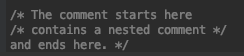

# 기본 문법

## Program entry point (시작점)
`main` 함수가 코틀린 앱의 시작점입니다.

```kotlin
fun main() {
    println("Hello world!")
}
```

## Functions (함수)

다음은 2개의 `Int` 파라미터와 `Int` 리턴값을 가지는 함수입니다.
```kotlin
fun sum(a: Int, b: Int): Int {
    return a + b
}
```

다음과 같이 생략이 가능합니다.

```kotlin
fun sum(a: Int, b: Int): Int = a + b
```

또한 리턴값이 없을 수 도 있습니다. 자바의 void와 유사하며 `Unit` 타입이라고 부릅니다.
```kotlin
fun printSum(a: Int, b: Int): Unit {
    println("sum of $a and $b is ${a + b}")
}
```

`Unit` 타입은 생략이 가능합니다.
```kotlin
fun printSum(a: Int, b: Int) {
    println("sum of $a and $b is ${a + b}")
}
```

## Variables (변수)

Read-only 지역 변수는 `val` 키워드를 사용해서 정의합니다. 이것들은 오직 한번만 값을 할당할 수 있습니다.

```kotlin
val a: Int = 1  // 즉시할당
val b = 2   // `Int` 타입 생략
val c: Int  // 초기화 하지 않으면 타입을 꼭 명시해야합니다.
c = 3       // 지연 할당
```

재할당 가능한 변수는 `var` 키워드를 사용해서 정의합니다.

```kotlin
var x = 5 // `Int` 타입 생략
x += 1
```

Top-level 변수
```kotlin
val PI = 3.14
var x = 0
​
fun incrementX() {
    x += 1
}

// 실행
fun main() {
    println("x = $x; PI = $PI")
    incrementX()
    println("incrementX()")
    println("x = $x; PI = $PI")
}
```

결과
```
x = 0; PI = 3.14
incrementX()
x = 1; PI = 3.14
```

## Comments (주석)
single-line, muti-line 주석 모두 지원합니다.

```kotlin
// This is an end-of-line comment

/* This is a block comment
   on multiple lines. */
```

Block 주석은 nested 될 수 있습니다.


